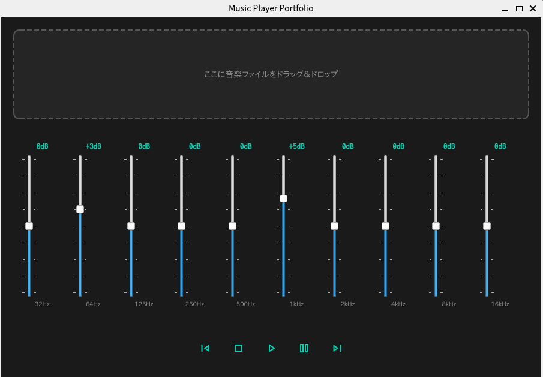
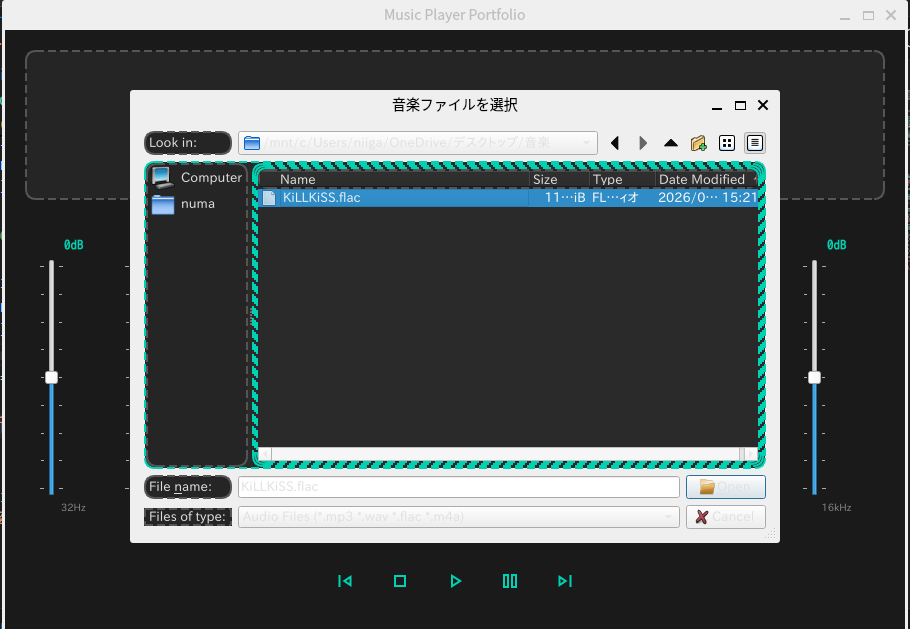

# Music Player (Provisional)

「車輪の再発明」を通じて、デジタルオーディオ信号処理とマルチ言語アーキテクチャを深く理解することを目的とした音楽再生アプリケーションです。

一般的な音楽プレイヤーが提供するデータベース管理機能をあえて排除し、「音の解析と加工（イコライザー）」という信号処理の核心部分に注力した設計を行っています。

---

## 🎨 コンセプト
- **適材適所のマルチ言語構成**: 高速な計算が必要な信号処理部はRust、柔軟なUI構築にはPython（PySide6）を採用。
- **信号処理の可視化**: 高速フーリエ変換（FFT）を用いたリアルタイム・スペクトラムアナライザーの実装。
- **ピュアなユーザー体験**: データベースレスな設計。ドラッグ＆ドロップによるオンメモリなキュー管理に特化。

---

## 🛠 技術スタック
- **GUI**: Python 3.x / PySide6 (Qt for Python)
- **Signal Processing Engine**: Rust (Planned: FFT, Equalizer)
- **Binding**: PyO3 (Python/Rust bridge)
- **Metadata**: Mutagen (ID3, Vorbis, etc.), Pillow (Image processing)
- **Environment**: WSL2 (Ubuntu) / Development target is Native App

---

## 🏗 アーキテクチャ
本プロジェクトでは、高レイヤ（UI）と低レイヤ（Engine）を明確に分離する疎結合な設計を採用しています。

### 1. Python Layer (Frontend)
- **PySide6**: ダークモードを基調としたネイティブUI。コンポーネント指向によるクラス設計。
- **Mutagen**: 音楽ファイルのタグ情報をオンメモリで解析。
- **SVG Icons**: OS環境（WSL/Windows/macOS）に依存しない、スケーラブルでシャープなグラフィック表現。

### 2. Rust Layer (Backend - Under Development)
- **Performance**: SIMD等を意識した高速な信号処理ロジック。
- **Algorithm**: 窓関数（Hann Window）を適用したFFT計算。
- **Bridge**: PyO3によるPythonモジュールとしての統合。

---

## 📈 現在の実装状況
- [x] PySide6を用いたダークモードGUIの構築
- [x] 各種コンポーネント（Slider, Controls, DropZone）のモジュール化
- [x] SVGアイコンによるUI/UXの改善
- [x] Mutagenによるメタデータ表示の実装
- [ ] Rust製エンジンの統合
- [ ] リアルタイム・イコライザーの実装

## 🗓️ [2026-01-26] メタデータ抽出の実装と環境依存問題の解決

モックアップから実機能への第一歩として、音楽ファイルの解析ロジックを実装しました。  

* **WSL2環境におけるファイルアクセスの解決**
    * **課題**: WindowsエクスプローラーからWSLg上のアプリへのドラッグ＆ドロップが、OS間の権限制約等によりブロックされる（🚫表示）問題が発生。
    * **解決**: `QFileDialog` を活用し、`/mnt/c/` を経由してWindows側のファイルシステムへ直接アクセスする方式を採用。確実なファイル選択を実現。

* **マルチフォーマット対応のロジック構築**
    * **課題**: MP3（ID3タグ）とFLAC（Vorbis Comment）でメタデータの格納形式（タグ名）が異なり、一律の処理では情報を取得できない。
    * **解決**: `mutagen` ライブラリを採用し、タグの種類に応じて取得キーを動的に切り替えるラッパーを実装。
    * **結果**: MP3、FLAC共に「タイトル・アーティスト・アルバム・演奏時間」の正確な抽出に成功。タグ未設定時のフォールバックとしてファイル名を表示する処理も実装。

1.モック

2.楽曲データ選択

3.メタデータ(曲名等)
.png)
---

## 🚀 セットアップ
```bash
# リポジトリのクローン
git clone https://github.com/nununuma-sabu/music_player.git
cd music_player

# 依存ライブラリのインストール
pip install -r requirements.txt

# アプリケーションの起動
python main.py
```

## 🐧 WSL2 / Linux 環境での実行について
本アプリは WSL2 (Ubuntu) 上での動作を確認していますが、Linux環境特有のフォントレンダリングや文字化け（豆腐現象）を回避するため、以下の設定を推奨します。

### 1. 日本語フォントのインストール
WSL側に日本語フォントがインストールされていない場合、UIの日本語が正しく表示されません。以下のコマンドで標準的なフォントをインストールしてください。

```bash
sudo apt update
sudo apt install -y fonts-noto-cjk fonts-ipafont-gothic
fc-cache -fv
```

### 2. 特殊記号（シンボル）の表示
再生・停止などのメディア操作記号は、環境に左右されないよう SVGベクター形式のアイコン を採用しています。これにより、特定のシンボルフォント（fonts-symbola等）が未導入の環境でも、デザインが崩れることなく一貫したUIを提供します。

