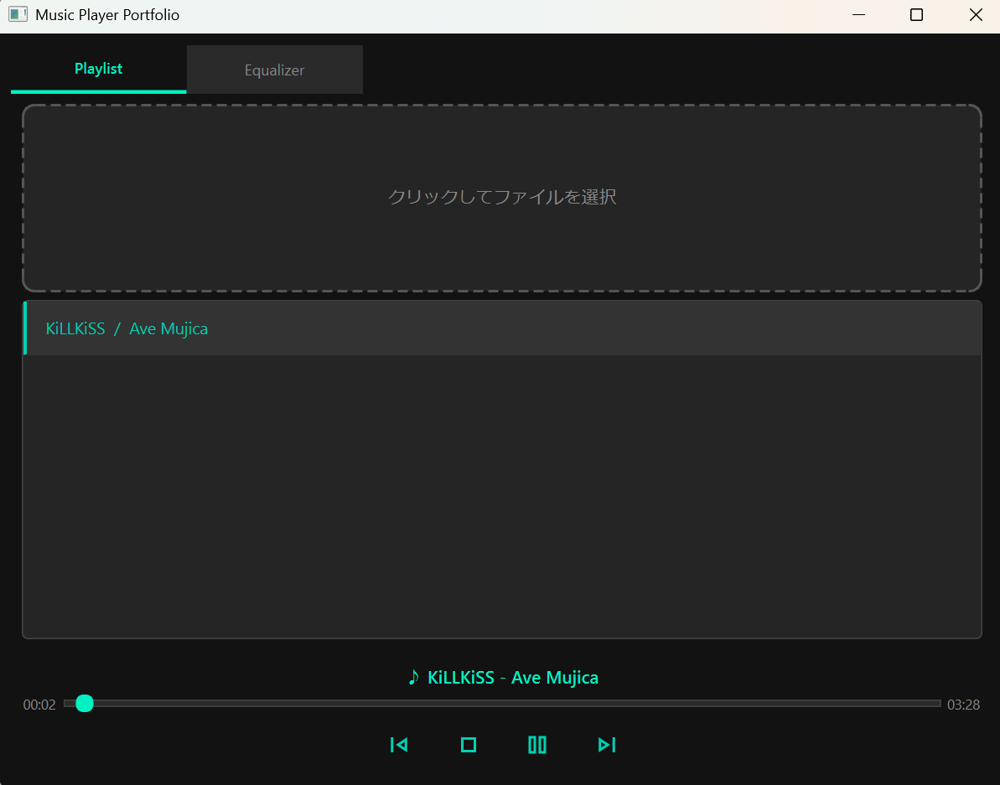

# Music Player (Provisional)


「車輪の再発明」を通じて、デジタルオーディオ信号処理とマルチ言語アーキテクチャを深く理解することを目的とした音楽再生アプリケーションです。

一般的な音楽プレイヤーが提供するデータベース管理機能をあえて排除し、「音の解析と加工（イコライザー）」という信号処理の核心部分に注力した設計を行っています。

---

## 🎨 コンセプト
- **適材適所のマルチ言語構成**: 高速な計算が必要な信号処理部はRust、柔軟なUI構築にはPython（PySide6）を採用。
- **信号処理の可視化**: 高速フーリエ変換（FFT）を用いたリアルタイム・スペクトラムアナライザーの実装。
- **ピュアなユーザー体験**: データベースレスな設計。ドラッグ＆ドロップによるオンメモリなキュー管理に特化。

---

## 🛠 技術スタック
- **GUI**: Python 3.x / PySide6 (Qt for Python)
- **Signal Processing Engine**: Rust (Planned: FFT, Equalizer)
- **Binding**: PyO3 (Python/Rust bridge)
- **Metadata**: Mutagen (ID3, Vorbis, etc.), Pillow (Image processing)
- **Environment**: WSL2 (Ubuntu) / Development target is Native App

---

## 🏗 アーキテクチャ
高レイヤ（UI）、ミドルレイヤ（Core/Logic）、低レイヤ（Engine）を明確に分離しています。

### 1. Python UI Layer
- **PySide6**: ダークモードを基調としたネイティブUI。各パーツをコンポーネント化。
- **SVG Icons**: OS環境に依存しない、スケーラブルなグラフィック表現。

### 2. Python Core Layer
- **Metadata Handler**: `mutagen` を用いたメタデータ抽出。MP3やFLACなどのマルチフォーマットに対応。
- **Logic Isolation**: UIからロジックを分離し、ユニットテストが可能な設計を採用。

### 3. Rust Layer (Backend - Under Development)
- **Performance**: SIMD等を意識した高速な信号処理ロジック。
- **Bridge**: PyO3によるPythonモジュールとしての統合。

---

## 📈 現在の実装状況
- [x] PySide6を用いたダークモードGUIの構築
- [x] 各種コンポーネント（Slider, Controls, DropZone）のモジュール化
- [x] ファイル選択ダイアログの実装（WSL2環境でのWindowsファイルアクセス対応）
- [x] Mutagenによるメタデータ抽出ロジックの実装（MP3/FLAC対応）
- [x] 信号処理ロジックの分離・リファクタリング
- [ ] プレイリスト表示機能の実装
- [ ] Rust製エンジンの統合
- [ ] リアルタイム・イコライザーの実装

## 📅 [2026-01-31] 進む・戻るボタンの実装

## 📅 [2026-01-28] プレイリストの自動連続再生対応

## 📅 [2026-01-28] プレイリストからの楽曲削除機能追加

## 📅 [2026-01-28] 楽曲追加時の自動再生機能の実装

## 📅 [2026-01-27] 音量スライダー実装
* **音量スライダー実装**: アプリの右下部分に音量スライダーを実装しました。

## 📅 [2026-01-27] アプリのアイコン対応
* **アイコン設定**: アプリの左上とタスクバー部分にアイコンを設定しました。

## 📅 [2026-01-27] 実行ファイル作成対応
* **アセット完全同期**: `_MEIPASS` を考慮したパス解決関数の導入により、PyInstaller ビルド時における SVG アイコンの消失問題を解消。
* **UI/UXの最終研磨**: `Fusion` スタイルと `QPalette` の併用により、OS に依存しないブランドカラー（ミントグリーン）の定着に成功。

## 📅 [2026-01-27]  リファクタリング実施
* **リファクタリング（関心の分離）**: 
    * `MainWindow` から再生ロジックを分離し、`AudioEngine` クラスへ委譲。単一責任原則（SRP）に基づき、UIは「指揮官（配置・配線）」、エンジンは「心臓部（再生管理）」としての役割を明確化。
    * メソッドの整理により、`MainWindow` の可読性と将来の Rust 連携における拡張性を大幅に向上。

## 📅 [2026-01-27]  タブの改善
* **タブUIの視認性改善**: `QTabBar::tab:selected` に対する専用スタイルを実装。ミントグリーンのアクセントカラーと下線により、アクティブなタブを明確に判別可能に。
* **シークバーのUX改善**: カスタムクラス `ClickableSlider` を実装。標準のページジャンプ挙動をオーバーライドし、クリック位置へのダイレクトジャンプ機能を搭載。

## 📅 [2026-01-27] テスト品質の極致とカバレッジ 94% 達成
* **高度なコンポーネントテスト**: `DropZone` や `PlaylistView` のイベントシミュレーションを実装し、カバレッジを 86% から 94% へ引き上げ。
* **モック活用によるロジック検証**: `unittest.mock` を用いて、実ファイルに依存しない `MainWindow` の統合テストフローを確立。`PlaylistView` は 100% の網羅率を達成。
* **UI/UXの完成**: 10バンド構成の漆黒のイコライザー（#121212）および再生トグルボタンの挙動を、テストによって完全に担保。

## 📅 [2026-01-27] UIコンポーネントの高度化とデザイン改修
* **再生コントロールの操作性向上**
    * 再生・一時停止ボタンを1つの「トグルボタン」に統合し、UIを省スペース化。
    * `QMediaPlayer` の `playbackStateChanged` シグナルを購読し、再生状態に応じてアイコン（▶/||）を自動で切り替える同期ロジックを実装。
* **グラフィックイコライザーの拡張**
    * 単一バンドから、ISO標準準拠の10バンド構成（31Hz〜16kHz）へ拡張し、`QHBoxLayout` による横並びレイアウトを構築。
    * イコライザー背景をダークモード（`#121212`）へ変更。`Qt.WA_StyledBackground` 属性の有効化により、QWidgetにおける背景描画の問題を解決。
* **環境最適化の継続**
    * WSL2/WSLg環境での音飛び問題を考慮し、引き続きWindowsネイティブでの実行・検証を標準化。

## 📅 [2026-01-27] シークバー実装とUI/ロジックの完全同期
* **リアルタイム・シーク機能**: `QSlider` を用いたシークバーを実装。再生位置（`positionChanged`）と楽曲長（`durationChanged`）をUIに即座に反映。
* **双方向インタラクション**: スライダーのドラッグによる再生位置のジャンプ機能を実装し、操作性を向上。
* **コンポーネントの安定化**: `EqSlider` の初期化エラーを修正し、各UIコンポーネント間のインポート依存関係を整理・最適化。

## 🗓️ [2026-01-27] オーディオ再生機能の実装と環境トラブルシューティング

### 🚀 実装された新機能
* **オーディオ再生エンジン**: `QtMultimedia` (QMediaPlayer, QAudioOutput) を統合し、実ファイルの再生機能を実装。
* **動的ステータス表示**: プレイリストでの選曲に連動して、再生コントロールエリアに「♪ 曲名 - アーティスト」をリアルタイム表示する機能を実装。

### 🛠️ 開発環境に関する技術メモ（WSL2 vs Windows Native）
開発過程において、WSL2 (Ubuntu) 上でのオーディオ再生にスタッタリング（音飛び）が発生。以下の検証を実施しました。

1. **WSLg オーディオブリッジの検証**: `PULSE_SERVER` の設定やレイテンシ（`PULSE_LATENCY_MSEC`）の調整を試行したが、仮想化によるオーバーヘッドを完全には解消できず。
2. **解決策**: PySide6 のクロスプラットフォーム特性を活かし、実行環境を Windows ネイティブへ移行。
3. **結果**: オーディオデバイスへのダイレクトなアクセスにより、FLAC 等のハイレゾ音源でも負荷のないスムーズな再生を実現。
   * **教訓**: GUI およびリアルタイム性が求められるオーディオフロントエンドの開発では、Windows ネイティブ実行が最も安定する。

## 🗓️ [2026-01-26] UIレイアウトの刷新（QTabWidgetの導入）
* **UIの整理**: プレイリストの実装に伴い、画面内の要素密度が増加したため、`QTabWidget` を導入。
* **機能分離**: 「Player/Playlist」と「Equalizer」をタブで切り替える構成に変更し、各機能の視認性を確保。
* **永続コントロール**: 再生操作系をメインレイアウトの下部に固定し、タブ切り替え時も常に操作可能なUXを実現。

## 🗓️ [2026-01-26] ユニットテストの導入とロジックのリファクタリング

* **関心の分離（Separation of Concerns）**
    * **改善**: `MainWindow` に記述されていたメタデータ抽出ロジックを `core/metadata.py` へ移譲。
    * **メリット**: UI層（表示）とデータ層（解析）を切り離すことで、UIを表示させずにロジックのみをテストすることが可能になりました。
    * **テストカバレッジの可視化**: `pytest-cov` を導入し、Core層におけるロジックの網羅率を計測。
    * **品質指標の確保**: HTMLレポートにより、未テスト項目の抽出と継続的な品質改善を可能にしました。

* **pytest による単体テストの実装**
    * **モックの活用**: `unittest.mock` を使用し、実際の音声ファイルを用意することなく、MP3やFLACの解析ロジックを検証可能にしました。
    * **トラブルシューティング**: 
        * **インポートパスの問題**: `python3 -m pytest` を用いた実行により、プロジェクトルートを `sys.path` に追加し、モジュール解決エラーを回避。
        * **パッチ対象の適正化**: `mutagen.File` ではなく、実際にインポートされて使用されている `core.metadata.MutagenFile` をパッチ対象とすることで、モックを確実に機能させました。

* **テスト実行手順**
    ```bash
    # プロジェクトルートで実行
    python3 -m pytest

    # カバレッジを出力したい場合
    python3 -m pytest --cov=core --cov=ui --cov-report=html tests/
    ```

最低限の機能を備えたプロトタイプまでは実装

---

## 🚀 セットアップ
```bash
# リポジトリのクローン
git clone https://github.com/nununuma-sabu/music_player.git
cd music_player

# 依存ライブラリのインストール
pip install -r requirements.txt

# アプリケーションの起動
python main.py
```

## 🐧 WSL2 / Linux 環境での実行について
本アプリは WSL2 (Ubuntu) 上での動作を確認していますが、Linux環境特有のフォントレンダリングや文字化け（豆腐現象）を回避するため、以下の設定を推奨します。

### 1. 日本語フォントのインストール
WSL側に日本語フォントがインストールされていない場合、UIの日本語が正しく表示されません。以下のコマンドで標準的なフォントをインストールしてください。

```bash
sudo apt update
sudo apt install -y fonts-noto-cjk fonts-ipafont-gothic
fc-cache -fv
```

### 2. 特殊記号（シンボル）の表示
再生・停止などのメディア操作記号は、環境に左右されないよう SVGベクター形式のアイコン を採用しています。これにより、特定のシンボルフォント（fonts-symbola等）が未導入の環境でも、デザインが崩れることなく一貫したUIを提供します。

## 📦 ビルドガイド
本プロジェクトは PyInstaller を使用してスタンドアロンの実行ファイルを生成します。ビルド前に、アイコンリソースが含まれる `styles/icons` フォルダがルートディレクトリに存在することを確認してください。

### 💻 Windows (PowerShell)
Windows 環境で `.exe` ファイルを生成するコマンドです。

```powershell
pyinstaller --onefile --windowed `
            --name "PortfolioMusicPlayer" `
            --icon="styles/icons/app_icon.ico" `
            --add-data "styles/icons;styles/icons" `
            --collect-submodules core `
            --collect-submodules ui `
            --noconfirm `
            main.py
```

### 🐧 Linux / WSL (bash)
WSL または Linux 環境で実行バイナリを生成するコマンドです。
```bash
pyinstaller --onefile --windowed \
            --name "PortfolioMusicPlayer" \
            --add-data "styles/icons:styles/icons" \
            --collect-submodules core \
            --collect-submodules ui \
            --noconfirm \
            main.py
```